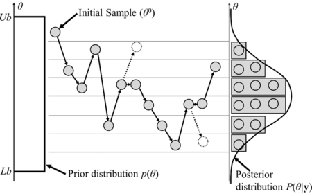
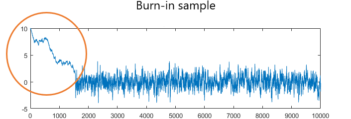
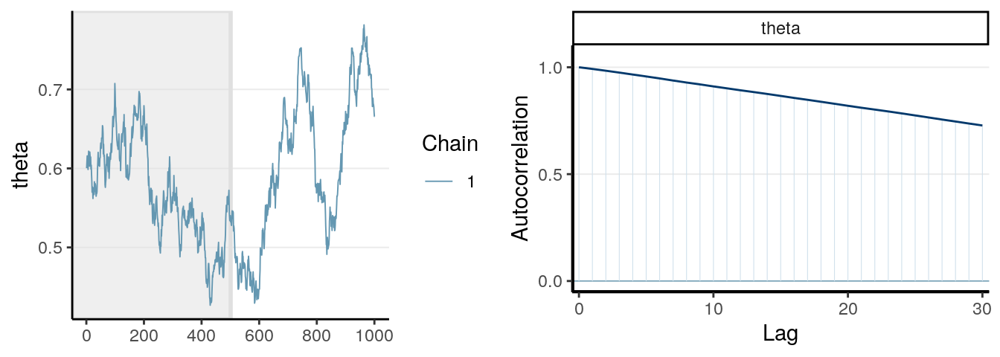
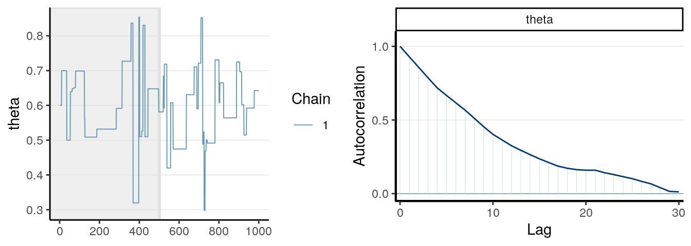
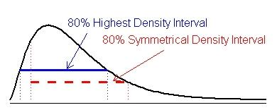

```{r setup, include=FALSE}
knitr::opts_chunk$set(echo = TRUE)
if (!require("brms")) {
  install.packages("brms")
}
if (!require("tidyverse")) {
  install.packages("tidyverse")
}
if (!require("posterior")) {
  install.packages("posterior")
}
if (!require("bayesplot")) {
  install.packages("bayesplot")
}

library(brms)
library(tidyverse)
library(posterior)
library(bayesplot)

sleepstudy <- read.csv("sleepstudy.csv")

set.seed(1000)
```

## Dataset Description

`sleepstudy` data measures the average reaction for subjects in a sleep deprivation study.

```{r}
head(sleepstudy)
```

`Reaction`: Average reaction time (in ms)

`Days`: Number of days of sleep deprivation

`Subject`: Subject number on which the observation was made

According to the documentation, Days 0 and 1 were for adaptation and training, and sleep deprivation started after day 2, which should serve as the baseline.

```{r}
ggplot(sleepstudy) +
  geom_point(aes(x = Days, y = Reaction)) +
  geom_rect(xmin = -Inf, xmax = 1.5, ymin = -Inf, ymax = Inf, fill = "red", alpha = 0.002) +
  scale_x_continuous(breaks = seq(0, 10, 2)) +
  ggtitle("Reaction Time vs. Days of Sleep Deprivation")
```

```{r}
sleepstudy <- sleepstudy %>%
  filter(Days >= 2) %>%
  mutate(Days2 = Days - 2, Subject = as.factor(Subject))

ggplot(sleepstudy) +
  geom_point(aes(x = Days2, y = Reaction)) +
  ggtitle("Reaction Time vs. Days of Sleep Deprivation, Adjusted to Baseline") +
  xlab("Days of Sleep Deprivation")
```

## Running Simple Linear Regression Model with `brms`

$y_i = \text{Reaction Time}$

$x_i = \text{Number of days of sleep deprivation}$

Let's fit a simple linear regression model predicting reaction time, $y_i$, using the number of days of sleep deprivation, $x_i$.

Let's first write the model in the form you might already be familiar with:

$$
y_i = \alpha + \beta x_i + \epsilon_i \\
\epsilon_i \sim N(0, \sigma)
$$

Ignoring the residual term, $\epsilon_i$, the model is estimating the **mean reaction time** as a linear function of number of days. The residual term is the amount of deviation from the estimated mean for a particular observation.

Bayesian models usually formulate the same idea but using probability distributions:

$$
y_i \sim N(\alpha + \beta x_i, \sigma)
$$

According to the formulation above, the response is a drawn from a normal distribution where the mean is determined by the number of days and unknown standard deviation.

Alternative but the same formulation:

$$
y_i \sim N(\mu_i, \sigma) \\
\mu_i = \alpha + \beta x_i
$$

In this case we replace the mean inside the normal distribution with $\mu_i$, and $\mu_i$ is determined by the number of days.

By using this formulation, we already have our likelihood function, $P(y|\theta)$ , which is the normal distribution!

In the formulation above, we have three unknown parameters: $\alpha$, $\beta$, and $\sigma$.

What do these parameters need? They need priors! Before we specify them manually, let's just try running a model with `brms` using the package's default priors.

How would you run the model above as a frequentist linear regression model in R?

```{r}
reaction_model_lm <- lm(Reaction ~ Days2, data = sleepstudy)
summary(reaction_model_lm)
```

Specifying the same model with `brms` is similar:

```{r}
reaction_model_default_prior <- brm(
  formula = Reaction ~ Days2,
  data = sleepstudy,
  family = gaussian(), # likelihood
  file = "model/default_prior.rds" # save the model
)

reaction_model_default_prior
```

You can extract posterior samples using `as_draws_df()`

```{r}
posteriors <- as_draws_df(reaction_model_default_prior)
head(posteriors)
```

Each row represents a list (or vector) of each draw. For example, first row corresponds to $\theta^{(1)}$, second row to $\theta^{(2)}$, and so on.

In this workshop, we can ignore `"Intercept"` column. Internally `brms` centers the predictors to speed up computation. `b_Intercept` is at the scale we want.

## Choosing Priors

Revisit model:

$$
y_i \sim N(\mu_i, \sigma) \\
\mu_i = \alpha + \beta x_i
$$

For our model, the intercept would be the average reaction time of a person ($x_i = 0$). Let's Google that value.

[Google average human reaction time](https://www.google.com/search?q=average+human+reaction+time&oq=average+human+reactio&gs_lcrp=EgRlZGdlKgoIABAAGIAEGPkHMgoIABAAGIAEGPkHMgYIARBFGDkyBwgCEAAYgAQyBwgDEAAYgAQyBwgEEAAYgAQyBwgFEAAYgAQyBwgGEAAYgAQyBwgHEAAYgAQyBwgIEAAYgATSAQgzMDQ0ajBqMagCALACAA&sourceid=chrome&ie=UTF-8).

According to Google, the average human reaction time is 0.25 seconds, or 250 milliseconds.

Using this value as our reference, we can use a normal distribution to set prior for the intercept. For normal distribution, area under -2 to 2 standard deviations represents 95% of the probability. I think it's reasonable to expect the average reaction time be between 150 and 350 milliseconds. Therefore we will set the prior for the intercept to be $Normal(250, 50)$.

```{r}
# Plot prior for the intercept
data.frame(
  alpha = 80:420,
  density = dnorm(80:420, mean = 250, sd = 50)
) %>%
  ggplot() +
  geom_line(aes(x = alpha, y = density)) +
  geom_vline(xintercept = c(150, 350), linetype = "dashed", color = "blue") +
  geom_vline(xintercept = 250, color = "darkgrey", linetype = "dashed") +
  geom_hline(yintercept = 0, color = "darkgrey", linetype = "dashed") + 
  xlab("alpha") +
  coord_cartesian(xlim = c(100, 400)) +
  ggtitle("Prior Distribution for Intercept (Average Reaction Time)",
          "Normal(250, 50); Vertical lines represecnt +- 2 sd") +
  theme_classic()
```

For the slope, I want to start by placing most of my weight around 0 to start as fair as possible. I don't have a strong prior knowledge about the effect, so I will place a weakly informative prior by setting 100 as standard deviation. I think it's reasonable to assume that a day of sleep deprivation won't affect the reaction time by 200/250 = 80%.

$$\beta \sim Normal(0, 100)$$

This prior places \~95% of prior probability for slope to be within -200 and 200.

```{r}
# Plot prior for the intercept
data.frame(
  beta = -300:300,
  density = dnorm(-300:300, mean = 0, sd = 100)
) %>%
  ggplot() +
  geom_line(aes(x = beta, y = density)) +
  geom_vline(xintercept = c(-200, 200), linetype = "dashed", color = "blue") +
  geom_vline(xintercept = 0 , color = "darkgrey", linetype = "dashed") +
  geom_hline(yintercept = 0, color = "darkgrey", linetype = "dashed") +
  xlab("Beta") +
    coord_cartesian(xlim = c(-280, 280)) +
ggtitle("Prior Distribution for Intercept (Average Reaction Time)",
          "Normal(250, 50); Blue Vertical lines represecnt +- 2 sd") +
  theme_classic()
```

Setting prior for error standard deviation may be a little more tricky. One important thing to remember is that the standard deviation has to be positive. One common choice for weakly informative prior for $\sigma$ is half Cauchy distribution. Cauchy distribution is shaped like a normal distribution but with much heavier tails, meaning there is more density (and therefore probability) for extreme values. Similar to normal distribution, Cauchy distribution also has a scaling parameter. I will set the parameter to be at 50.

$$\sigma \sim HalfCauchy(0, 50)$$

```{r}
(pcauchy(100, location = 0, scale = 50) - pcauchy(0, location = 0, scale = 50)) * 2
(pcauchy(200, location = 0, scale = 50) - pcauchy(100, location = 0, scale = 50)) * 2
```

This distribution implies the following:

$P(0 < \sigma < 100) \approx 0.70$

$P(100 < \sigma < 200) \approx 0.14$

$P(200 < \sigma) \approx 0.16$

```{r}
# Plot prior for the intercept
data.frame(
  sigma = 0:300,
  density = dcauchy(0:300, location = 0, scale = 50)
) %>%
  ggplot() +
  geom_line(aes(x = sigma, y = density)) +
  xlab("Sigma") +
  ylim(0, 0.007) +
  geom_vline(xintercept = 0 , color = "darkgrey", linetype = "dashed") +
  geom_hline(yintercept = 0, color = "darkgrey", linetype = "dashed") +
  coord_cartesian(xlim = c(0, 250)) +
  ggtitle("Prior Distribution for Intercept (Average Reaction Time)",
          "HalfCauchy(0, 50)") +
  theme_classic()
```

### Setting Prior in brms

Let's specify the model with priors now:

$$
y_i \sim Normal(\mu_i, \sigma) \\
\mu_i = \alpha + \beta x_i \\
\alpha \sim Normal(250, 50) \\
\beta \sim Normal(0, 100) \\
\sigma \sim HalfCauchy(0, 50)
$$

To set the prior in `brms`, we can use the `prior=` argument.

In our model, we have three different "types" or "classes" of parameters: intercept ($\alpha$), coefficient ($\beta$), and the error variance. The intercept and coefficient classes are quite straightforward. Remember how we selected our likelihood to be normal distribution? Depending on your data and how you would like to model it, you can choose different likelihood functions, such as binomial, poisson, student t, and more. [Each of these likelihood functions have special parameters associated with it]{.underline}. In normal likelihood, this special parameter is the standard deviation, or sigma.

We can set the prior for each of these classes separately using the `set_prior()` function.

For each definition of the prior, we specify

1.  the distribution
2.  the class of the parameter as strings.

And finally combine all priors with `c()`

The distribution is specified Stan language. Distributions available in Stan are listed [here](https://mc-stan.org/docs/functions-reference/).

```{r}
reaction_model <- brm(
  formula = Reaction ~ Days2,
  data = sleepstudy,
  family = gaussian(),
  prior = c(
    set_prior("normal(250, 50)", class = "Intercept"),
    set_prior("normal(0, 100)", class = "b"),
    set_prior("cauchy(0, 50)", class = "sigma", lb = 0)
  ),
  file = "model/reaction_model.rds"
)
```

You can check priors of the model with `get_prior()`.

```{r}
get_prior(reaction_model)
```

#### Exercise

What priors are used by default for `brm()`? How are they different from what we used?

HINT: You can check by running `get_prior()` on `reaction_model_default_prior`.

```{r}

```

## Checking MCMC Convergence

Before we start conducting inference with the model, we need to check that we have enough samples that estimates the posterior distribution well enough for valid inference.

MCMC algorithm is used to estimate the posterior distribution of the parameters by sampling in a sequence.

{width="399"}

Few things to note:

1.  Each sequence of draws is called a **chain**.Multiple chains are initialized to estimate the posterior.
2.  For each chain, you start with an initial value, and sequentially draw the next value. So the next draw depends on the value of the current draw.
3.  You want to let each chain run for a certain amount of time to search for the right parameter space, we call these draws **burn-in**. The burn-in samples are not used for inference. In `brms` this is also called **warmup**.
4.  For each draw, you are updating all the parameters. So for example, first draw for intercept corresponds to first draw for beta and sigma, and so on. (i.e. you are drawing a vector of parameters)

{width="483"}

The default behavior in `brms` is to have 4 chains with 2000 draws where 1000 of those draws are burn-in samples. These numbers can be checked when you print the model.

```{r}
summary(reaction_model)
```

### Trace Plot

We need to check that our posterior draws are valid for inference. One common diagnostic plot is called the **trace plot** (or also called caterpillar plot). This is a time series plot of the draws, which shows the evolution of parameters over the iterations.

One quick way to plot this is to call `plot()` on the model.

```{r}
plot(reaction_model)
```

You can also use `mcmc_trace()` function from the `bayesplot` package for more customization.

```{r}
mcmc_trace(reaction_model, c("b_Intercept"))
```

The plot above displays trace plot for all 4 chains.

Let's zoom in to look at the first 50 draws.

```{r}
mcmc_trace(reaction_model, pars = "b_Intercept", window = c(0,50))
```

If the MCMC algorithm is working correctly, then the trace plot should look like a thick, hairy catepillar.

What are we looking for in the trace plot?

1.  We want to see that all chains are exploring the same parameter space.
2.  All chains are quickly bouncing around the parameter space quickly and the trend remains stationary. This is also called **mixing**.

The following images demonstrates cases where the draws do not show good mixing.

{width="685"}

{width="684"}

### Rhat

Another diagnostic measure for MCMC algorithm is an **Rhat** value. This value assesses whether multiple MCMC chains have converged to the same posterior distribution. This ensures the reliability and consistency of the estimates from various chains.

Rhat is computed by comparing the following:

1.  **Between-chain variance** (how different chains are from each other)
2.  **Within-chain variance** (how much each chain fluctuates internally)

We want this value to be as close to 1 as possible.

Rule of thumb is the following:

$\hat{R} \approx 1.00$: Chains have likely converged (good)

$\hat{R} > 1.1$: Potential convergence issues; more samples may be needed

$\hat{R} \gg 1.1$: Serious non convergence issue; model my be misspecified

Rhat can be easily retrieved by displaying the model

```{r}
reaction_model
```

### What do I do if there are issues with MCMC?

#### Issues with the sampler

It's possible that you're not drawing enough samples, or you're not using the right "tuning parameters" that's meant to control the behavior of sampling. You can change the following to try and make improvements in the sampling.

1.  Increase the number of iteration by updating the `iter=` argument.

2.  Increase the warmup period by updating the `warmup=` argument

3.  Adjust the Step Size / Adaptation Parameters. Stan uses a special agorithm called **N**o **U**-**T**urn **S**ampling, and one of the tuning parameters for this algorithm is called `adapt_delta`. You can control the value in the following way:

```{r, eval=FALSE}
# NOT RUN
# reaction_model <- brm(
#   formula = Reaction ~ Days2,
#   data = sleepstudy,
#   family = gaussian(),
#   prior = c(
#     set_prior("normal(250, 50)", class = "Intercept"),
#     set_prior("normal(0, 50)", class = "b"),
#     set_prior("cauchy(0, 50)", class = "sigma", lb = 0)
#   ),
#   file = "model/reaction_model.rds",
#   control = list(adapt_delta = 0.95) # change adapt delta here
# )
```

#### Issues with the model

If these solutions don't work out, you may have to rethink about how you specified the model. These requires changes in your model definition, how you parameterize certain unknowns, and what prior you choose.

Some options are:

1.  **Reparameterize** the model: poorly scaled parameters lead to slow mixing or stuck chains.
2.  Use different priors: Diffuse priors or informative priors with small variance may interfere with the model exploring the parameter space
3.  Update the model. Maybe you have a model that doesn't fit the data well that it's struggling to estimate the parameters.

## Posterior Predictive Check

Now that you have the model and checked the quality of your MCMC samples, we can perform a **posterior predictive check**, which compares observed data to simulated data using the posterior.

The idea is that if our model is a good fit then we should be able to use our model to generate data that looks similar to the data we observed.

Posterior predictive check can be done with using `pp_check()` function.

```{r}
pp_check(reaction_model)
```

The think blue line represents distribution of the observed data. Each thin blue line in the background represent the distribution of simulated data conditional on parameters drawn from the posterior.

Let's see what's happening more in detail. Remember you can get posterior draw using `as_draws_df()`

```{r}
posteriors <- as_draws_df(reaction_model)
head(posteriors)
```

Remember that each row corresponds to a draw. What I want to do at this stage is see what the distribution of response would look like if I were to use each draw to model the response.

Let's take a look at the first draw. I have $\alpha = 266.662$, $\beta = 11.186$, $\sigma = 53.229$.

Using this, I have the following estimate for each observation in the data.

```{r}
simulated <- sleepstudy %>%
  select(Reaction, Days2) %>%
  mutate(`a + bx` = 266.662 + 11.186*Days2, sigma = 53.229) %>%
  rowwise() %>%
  mutate(predicted = rnorm(1, `a + bx`, sigma)) %>%
  ungroup()
head(simulated, 10)
```

```{r}
ggplot(simulated) +
  geom_density(aes(x = Reaction), color = "red", linewidth = 1) +
  geom_density(aes(x = predicted)) +
  ggtitle("Observed vs Simulated Response using Posterior Draw",
          "Red line is Observed")
```

This process is repeated for each draw. By default `pp_check()` uses a subset of draws (I believe 10) because using all 4000 draws would take a long time.

#### Exercise

`pp_check()` can serve an additional purpose of performing **prior predictive check**. Similar to posterior predictive check, you would be drawing parameters from a prior distribution to see the prior's implication on data generation.

The following model only contains draws from the prior distribution. Apply `pp_check()` to the following model to do prior predictive check.

What behavior do you see?

```{r}
reaction_model_prior_only <- brm(
  formula = Reaction ~ Days2,
  data = sleepstudy,
  family = gaussian(),
  prior = c(
    set_prior("normal(250, 50)", class = "Intercept"), # for intercept (alpha)
    set_prior("normal(0, 100)", class = "b"), # for coefficient (beta)
    set_prior("cauchy(0, 50)", class = "sigma", lb = 0) # special parameter, we set the lower bound
  ),
  file = "model/prior_only.rds",
  sample_prior = "only"
)
```

------------------------------------------------------------------------

Looking at the posterior predictive check, there is definitely room for improvement. For example, notice that we are actually taking multiple measurements per person. We could try to reflect that structure in the data by incorporating it in the model. However, due to time constraint, we will move onto summarising the posterior for now.

## Posterior Summary

The model output gives a quick summary about our model.

```{r}
summary(reaction_model)
```

You can get the summary in tabular data using `posterior_summary()`

```{r}
posterior_summary(reaction_model)
```

The table above shows the estimated mean and standard error of the parameter based on the posterior draws.

Q2.5 and Q97.5 are 2.5% and 97.5% quantiles of the posterior. Theses values make up the 95% **credible interval**. Since the posterior characterizes updated belief about the parameter values, the credible interval sets an interval for possible value of the parameter with specified probability.

```{r}
# manually calculate 2.5% and 97.5% quantiles
quantile(posteriors$b_Days2, probs = c(0.025, 0.975))
```

Another way to summarize the uncertainty is with **highest density interval** (HDI). The interval contains parameter values of highest probability and spans pre-specified probability. To visualize this, imagine that you have some distribution, and you are lowering a horizontal line from the top until the the area under the curve hits the target probability.

{width="396"}

Function for calculating this interval is not included as part of `brms` or `bayesplot`, but there are other packages that compute this (check out [`bayestestR`](https://easystats.github.io/bayestestR/reference/hdi.html))

`bayesplot` package also provides nice visualization functions that can show posterior distributions of parameters right out of the box. Functions to plot draws from MCMC are prefixed by `mcmc_*` .

```{r}
# you can choose parameters to plot using "pars="
mcmc_areas(reaction_model, pars = c("b_Days2", "sigma"))
mcmc_hist(reaction_model, pars = c("b_Intercept", "b_Days2", "sigma"))
```

You can also produce bivariate plots.

```{r}
mcmc_scatter(reaction_model, pars = c("b_Days2", "b_Intercept"))
```

You can also directly access posterior draws and create visualizations.

```{r}
posteriors <- as_draws_df(reaction_model)

ggplot() +
  # plot all lines according to posterior draw
  geom_abline(data = posteriors, 
              aes(intercept = b_Intercept, slope = b_Days2), 
              alpha = 0.09, color = "darkgrey") +
  # plot data points
  geom_point(data = sleepstudy, aes(x = Days, y = Reaction)) +
  # plot line with mean estimates
  geom_abline(intercept = mean(posteriors$b_Intercept), slope = mean(posteriors$b_Days2))
```

## Conclusion

This workshop barely scratches the surface of Bayesian modeling. It offers great amount of flexibility in the way you can model your data and define interactions between parameters. Once you get the hang of the syntax, MCMC diagnostics, and working with posteriors, you will have a lot more options in the way you can analyze your data.

There are a lot of resources available online and generally vignettes for packages like `brms`, `bayesplot` and stan offer good introduction to the topic. I hope you enjoyed the workshop and got a taste of what Bayesian analysis is like.
